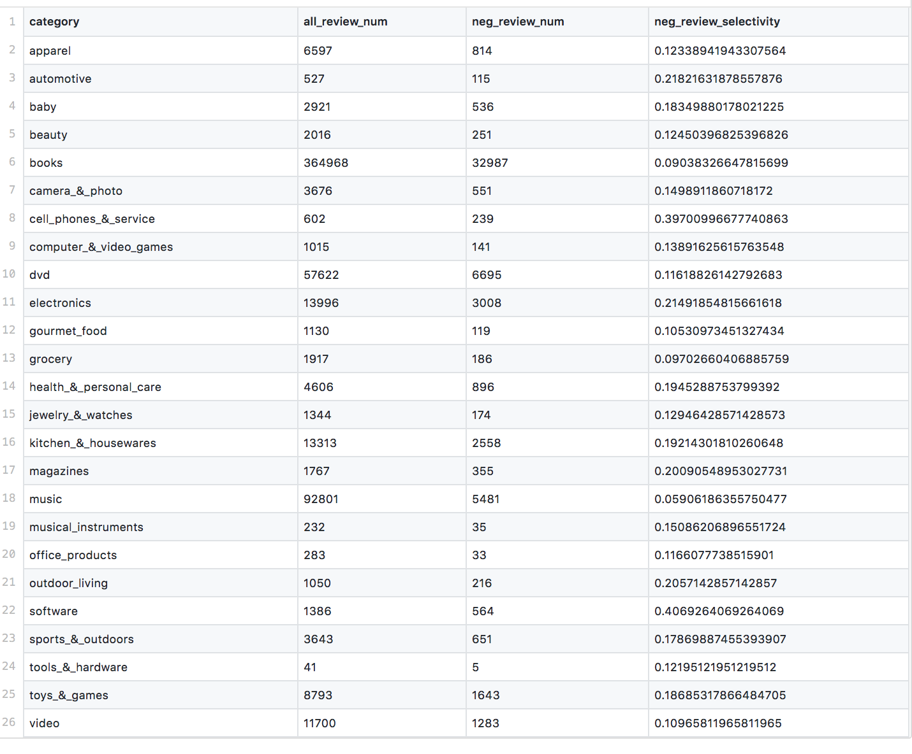

# Multi-Domain Amazon Sentiment Dataset

The dataset contains product reviews taken from [unprocessed.tar.gz](https://www.cs.jhu.edu/~mdredze/datasets/sentiment/).  There are 25 product categories. Each review can be either Positive(5) of Negative (1), the rest (having 2-4 stars) we discard in order to avoid uncertainty.

We created two predicate-based screening datasets of different sizes(from 1k to 100k) for predicates: 1) Books 2) Negative review.

Books selectivity = 0.61  
Negative review selectivity = 0.10  
Proportion of IN-scope reviews = 0.05  

*Selectivity is the proportion of documents that satisfy a predicate.

We keep the original properties of the dataset by sampling items according to the real proportion of categories and sentiment. One can create its own datasets of different predicates and size by running preprocessing.ipynb and specifying the only category, sentiment, and the size of the dataset.

 <b>Categories of the amazon products and counts: </b> 

