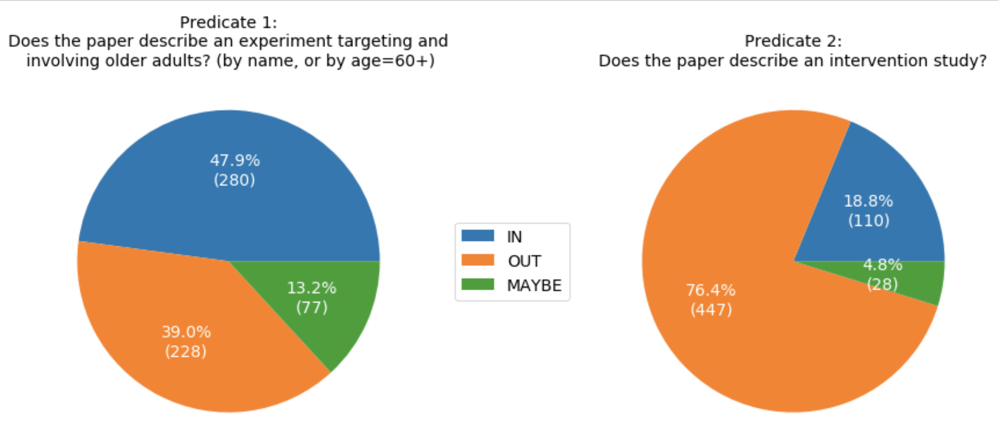
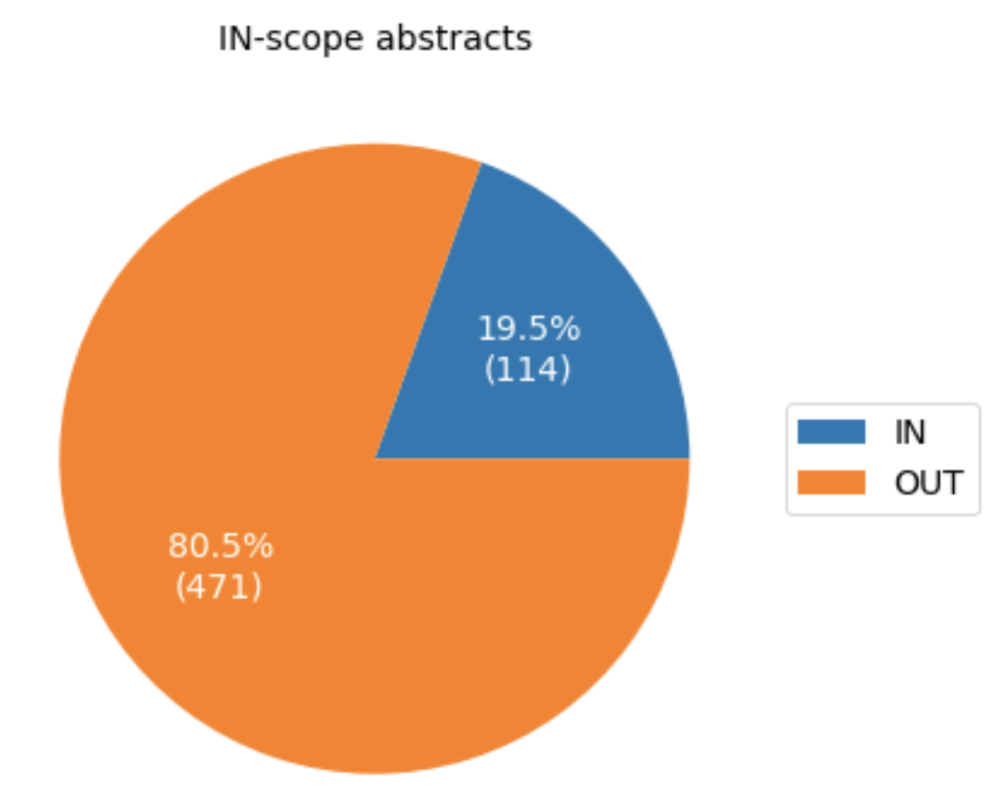
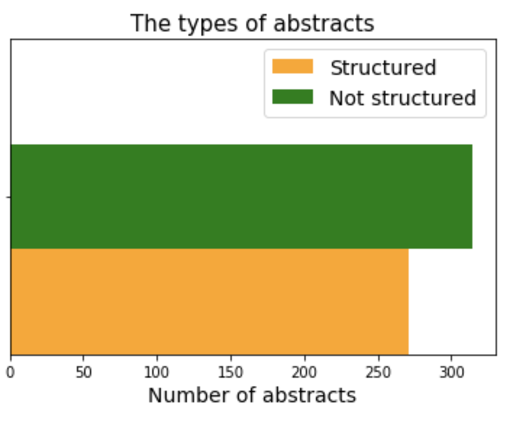

## loneliness-slr-2018

The dataset includes 585 papers annotated by an expert for 2 predicates: Predicate 1: Does the paper describe an experiment targeting and involving older adults? (by name, or by age=60+) Predicate 2: Does the paper describe an intervention study?
   
Selectivity of Predicate1: 0.61 
Selectivity of Predicate2: 0.23 
Proportion of IN-scope abstracts: 0.19

*Selectivity is the proportion of documents that satisfy a predicate.

Predicate characteristics:

     

             

 Proportion of positive items ( i.e. that satisfy both predicates): 

     
     
             

 Structure of abstracts: 

